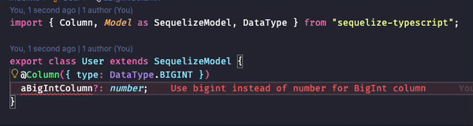

<div align="center">
    <h1>If DataType is BIGINT, then type must be bigint</h1>
    
    <h3>A Proof Of Concept of ESLint Custom rules</h3>
</div>

<br />
<br />

## Using Local Rules

ESLint allows to include custom rules by adding them in the `plugins` configuration, then referencing the rules in `rules`.

Because of it, we would need to distribute custom rules as NPM packages. In Monorepo, this works great due to Workspaces. But we have a problem in small codebases.

The following projects cover this later case:
* https://github.com/not-an-aardvark/eslint-plugin-rulesdir
* https://github.com/taskworld/eslint-plugin-local
* https://github.com/cletusw/eslint-plugin-local-rules

From all of them, `rulesdir` provided the best DX by being plug-n-play. Therefore, this POC uses `rulesdir`.


### Transpiling

ESLint can only run a rule if it is a **Javascript file**. Therefore, we must transpile all rules before using them.

This can be done in two ways:

* **Pre-transpiling**
* **Transpiling on the fly**

When writing a Javascript rule and using `rulesdir`, we must export the rule with `module.exports`. For Typescript-ESLint Custom Rules, we can use either `modules.exports = rule` or `export = rule`

#### Pre-transpiling

This method works by running `tsc` and pointing `rulesdir` to the `dist` folder

```js
const rulesDirPlugin = require("eslint-plugin-rulesdir");
rulesDirPlugin.RULES_DIR = "dist/eslint/";
```

During development, we must use `tsc -w` for detecting changes. However, **this is not a problem for Monorepos**.

Also, **this provides better perfomance**.

#### Transpiling on the fly

Although, pre-transpiling is not a problem at all, we can use a **loader in the eslint config file** to transpile rules on the fly.

This can be done with:
* `ts-loader`
* `@babel/node`
* `tsx` (`@esbuild-kit/cjs-loader`)

By placing:
* `require('ts-loader/register')`, or
* `require("@esbuild-kit/cjs-loader")`

At the top of the `.eslintrc.cjs`, the rules will be transpiled on the fly. This way, we can se our `rulesdir` to:

```js
require("@esbuild-kit/cjs-loader");

const rulesDirPlugin = require("eslint-plugin-rulesdir");
rulesDirPlugin.RULES_DIR = "eslint/";
```

## Testing

To use `RuleTester`, we must install:

```bash
pnpm add -D @typescript-eslint/rule-tester
```

Next, we need to setup the `.afterAll` hook ([Github Issue](https://github.com/typescript-eslint/typescript-eslint/issues/7275)).

With **Vitest** this can be done with:

```ts
import * as vitest from 'vitest';
import { RuleTester } from '@typescript-eslint/rule-tester';

RuleTester.afterAll = vitest.afterAll;
// if you are not using vitest with globals: true
RuleTester.it = vitest.it;
RuleTester.itOnly = vitest.it.only;
RuleTester.describe = vitest.describe;
```

See [`tests/check-bigint.test.ts`](https://github.com/vargasmesh/eslint-sequelize-bigint-rule/blob/main/tests/check-bigint.test.ts) for an example.
